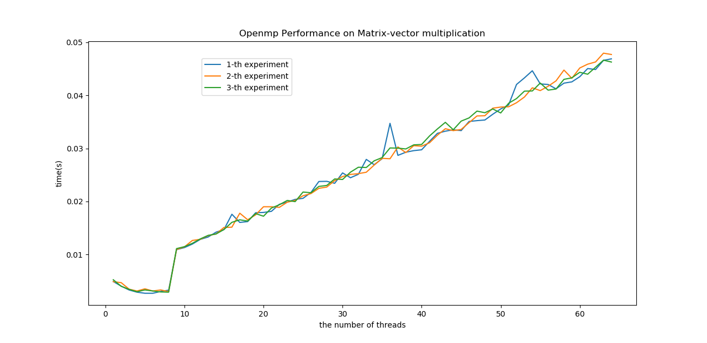
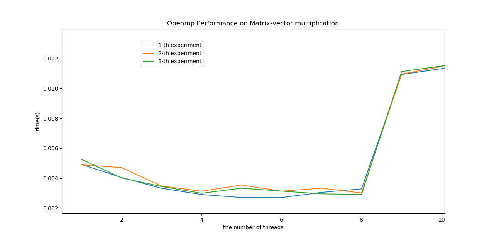

# 高性能导论第一次作业

使用openmp计算矩阵与向量相乘

## 内容

* [简要说明](#简要说明)
* [代码](#代码)
* [结果验证](#结果验证)

### 简要说明

openmp是一种支持多平台共享内存编程的API，
包括编程语言C，C++，Fortran和一些指令集和操作系统。
它包括编译器指令，一些环境变量和运行时动作。

矩阵与向量相乘问题中，最后得到的结果是一个向量，
这个向量的各个部分是数据独立的，即可以由矩阵的一部分
和向量相乘得到，所以是可以并行化的。

并行的方式首先将矩阵的各个部分分给各个计算节点，再将
这些部分分别和向量相乘，最后得到的结果在整合在一些
就可以得到结果。

### 代码

首先写出矩阵向量相乘的串行化代码

```c++
int i, j;
for (j = 0; j < n; j++) {
	for (i = 0; i < m; i++) {
		res[i] += A[i][j] * x[j];
	}
}
```

分析这段代码，共涉及到五个变量，共享内存的是数组res、
A、x，不共享的变量是i和j，因此可以直接将相应部分改为
并行程序，得到对应的并行化程序。

```c++
int i, j;
#pragma omp parallel num_threads(thread_count) \
shared(res, A, x) \
private(i, j)
for (j = 0; j < n; j++) {
#   pragma omp for
	for (i = 0; i < m; i++) {
		res[i] += A[i][j] * x[j];
	}
}
```

用openmp自带的计时程序计算时间，程序如下

```c++
#include <stdio.h>
#include <stdlib.h>
#include <omp.h>
#define MAXN 805 

int main(int argc, char* argv[]) {
    int thread_count = strtol(argv[1], NULL, 10);
    int m = 800, n = 800;
    double A[MAXN][MAXN], x[MAXN], res[MAXN];
	// 数据人为设定，方便测试
    for (int i = 0; i < m; i++) {
        for (int j = 0; j < n; j++) {
            A[i][j] = (double)(i + j);
        }
    }
    for (int j = 0; j < n; j++) {
        x[j] = 1.0;
    }

    // parallel
    double start = omp_get_wtime();
    int i, j;
    // int thread_count = omp_get_num_threads();
#   pragma omp parallel num_threads(thread_count) \
    shared(res, A, x) \
    private(i, j)
    for (j = 0; j < n; j++) {
#       pragma omp for
        for (i = 0; i < m; i++) {
            res[i] += A[i][j] * x[j];
        }
    }

    double finish = omp_get_wtime();
    double duration_parallel = finish - start;
    // for(int j = 0; j < m; j++) {
    //     printf("%4.0f ", res[j]);
    // }

    printf("the total time is %lf.\n", duration_parallel);
}

```

### 结果验证

程序通过样例后，开始比较不同线程数时程序的性能，
设置最大线程数64，比较不同线程数情况下计算矩阵向量相乘的时间。
首先得到数据，之后再用python做图。

```sh
#! /bin/bash

for data in {1..3}
do 
    for var in {1..64}
    do
        echo -n "${var} threads: " >> data${data}.txt
        ./h10 ${var} >> data${data}.txt
    done
done
```

```python
import matplotlib.pyplot as plt
import numpy as np
import re

result_x, result_y = [], []

plt.title('Openmp Performance on Matrix-vector multiplication')
plt.xlabel('the number of threads')
plt.ylabel('time(s)')

for i in range(1, 4):
    fp = open("data/data{number}.txt".format(number=i))
    line = fp.readline()
    x, y = [], []

    while line:
        res = re.findall(r"\d+\.?\d*", line)
        x.append(res[0])
        y.append(res[1])
        line = fp.readline()

    fp.close()

    x = list(map(float, x))
    y = list(map(float, y))

    plt.plot(x, y, label='{number}-th experiment'.format(number=i))
    result_x.append(x)
    result_y.append(y)

plt.legend(loc='upper left', bbox_to_anchor=(0.2, 0.95))
plt.show()
```

如图所示，是线程数和程序执行时间的关系图


从图中可以看到当线程数少于8时，openmp可以起到加速效果，
一旦线程数超过这个值，性能较单线程相比反而下降。

我们将这张图放大来看，如下图


从三次实验的平均值来看，当线程数为8时，
程序执行时间是最短的，相比于但线程数来说，
性能提高了2倍左右。一旦超过了这个值，
性能大幅下降，且性能基本上呈线性下降。

### 结论

openmp能够通过并行的方式优化程序性能，
但是提升幅度有限，且一旦线程数量设置不对，
反而有可能使程序性能下降。具体线程数量应该
由不同cpu来决定。


